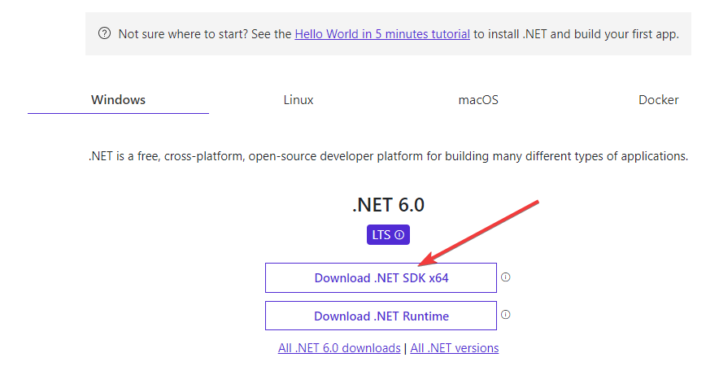

# Flipped classroom

## What is this masterclass about?

C# is one of the most common used programming languages used today. It can be used to build a large variety of applications: web, mobile, desktop and even games.

To use C# to build applications, you will need .NET. Think of it as a Swiss knife for building applications. It includes a lot of functionality out of the box and gives your program super powers.

Since C#/.NET is a large ecosystem, we will start lightly and introduce you to the language by writing simple console programs. Our next and final target will be building a simple Web API using [ASP.NET](http://ASP.NET) Core - a framework used to build web applications.

## What will you get out of the masterclass?

After finishing this masterclass you will have basic understanding of C# and .NET. You will also understand how to build a basic [ASP.NET](http://ASP.NET) Core application.

📚 The curriculum includes the following topics:

- Introduction to C# and .NET
- Connecting to database to change and retrieve data
- Creating and running a simple web application using [ASP.NET](http://ASP.NET) Core

## The structure of the masterclass

The masterclass follows the flipped classroom approach. This means that students are learning about the topic at home before coming to the classroom. In the classroom we will practice and discuss the topics in more detail.

Homework will be included in some sessions. While it isn’t mandatory, it is still highly recommended. After all, practice makes perfect.

You are required to have a laptop or a personal computer for writing and running code.

## How to get started

🎉 We are excited to have you onboard. Start by installing .NET on your machine:

- Go to [https://dotnet.microsoft.com/en-us/download](https://dotnet.microsoft.com/en-us/download)
- Click on download .NET SDK x64 button

- Start installation
- Verify that .NET has been installed by running `dotnet` command in console. You should see this result in the console

## Learning materials

Before and during the masterclass we recommend you take some time to go through the following materials.

- Youtube
  - [What is C#](https://youtu.be/BM4CHBmAPh4) (1:23 min)
  - [Hello world in C#](https://youtu.be/KT2VR7m19So) (4:39 min) / [Microsoft Learn link](https://docs.microsoft.com/en-gb/learn/modules/csharp-write-first/)
  - [Writing first variable (strings)](https://youtu.be/JSpC7Cz64h0) (8:40 min)
  - [Numbers](https://youtu.be/jEE0pWTq54U) (4:43 min)
  - [Decimals](https://youtu.be/kdKcpF9roeU) (5:43 min)
- [Branches (if/else) on Microsoft Learn](https://docs.microsoft.com/en-gb/learn/modules/csharp-if-elseif-else/1-introduction)

Learning new stuff can be exciting, but a bit overwhelming. Take your time when going through the materials. Experiment with the programs, change them a bit and have fun! Feel free to reach out to mentors on Slack on #dotnet channel.
