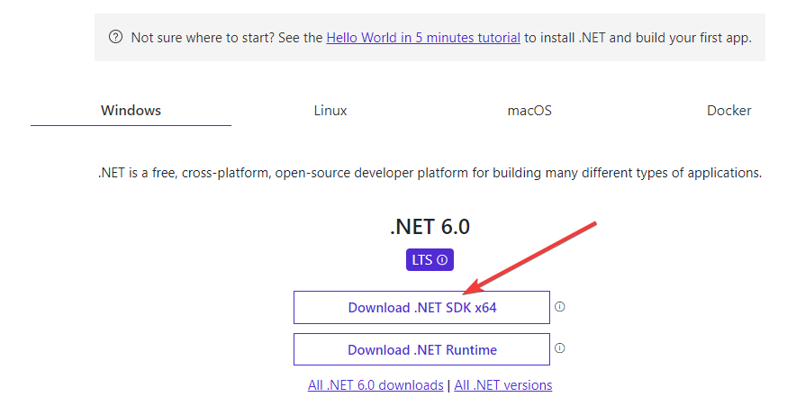

## How to get started

🎉 We are excited to have you onboard. Start by installing .NET on your machine:

- Go to [https://dotnet.microsoft.com/en-us/download](https://dotnet.microsoft.com/en-us/download)
- Click on download .NET SDK x64 button

- Start installation
- Verify that .NET has been installed by running `dotnet` command in console. You should see this result in the console

- Install C# extension for Visual Studio Code

## Learning materials

Before and during the masterclass we recommend you take some time to go through the following materials (1 - 2 hrs of watching & reading excluding Microsoft Learn).

  - [What is .NET? What is .NET? What's C#?](https://www.youtube.com/watch?v=bEfBfBQq7EE) (19 minutes)
  - [How did we get from .NET Framework to just .NET?
](https://www.youtube.com/watch?v=RbbPLCyHTts) (2:19 min)
  - [intro to .NET](https://docs.microsoft.com/en-us/dotnet/core/introduction) - stop reading after `SDK and runtimes
` part (10 min read)
  - [What is C#](https://youtu.be/BM4CHBmAPh4) (1:23 min)
  - [Hello world in C#](https://youtu.be/KT2VR7m19So) (4:39 min) / [Microsoft Learn link](https://docs.microsoft.com/en-gb/learn/modules/csharp-write-first/)
  - [.NET built-in types](https://docs.microsoft.com/en-gb/dotnet/csharp/language-reference/builtin-types/built-in-types)
  - [Writing first variable (strings)](https://youtu.be/JSpC7Cz64h0) (8:40 min)
  - [Numbers](https://youtu.be/jEE0pWTq54U) (4:43 min)
  - [Decimals](https://youtu.be/kdKcpF9roeU) (5:43 min)
  - [Branches (if/else) on Microsoft Learn](https://docs.microsoft.com/en-gb/learn/modules/csharp-if-elseif-else/1-introduction)
  - [C# types](https://docs.microsoft.com/en-gb/dotnet/csharp/fundamentals/types/)

Learning new stuff can be exciting, but a bit overwhelming. Take your time when going through the materials. Experiment with the programs, change them a bit and have fun! Feel free to reach out to mentors on Slack on #dotnet-masterclass-2022 channel.
